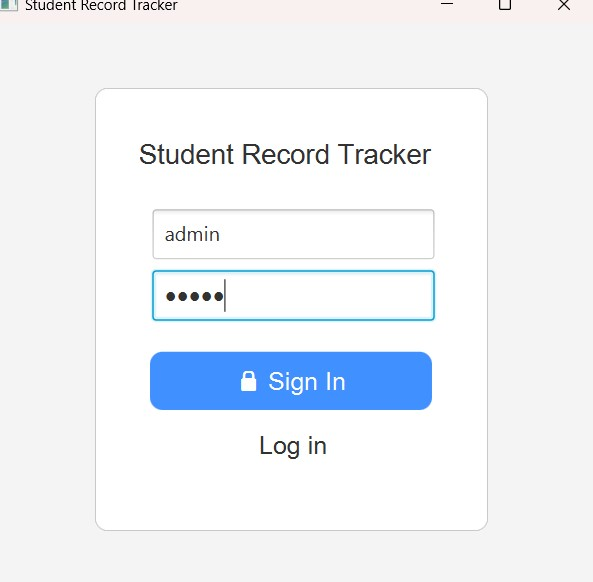
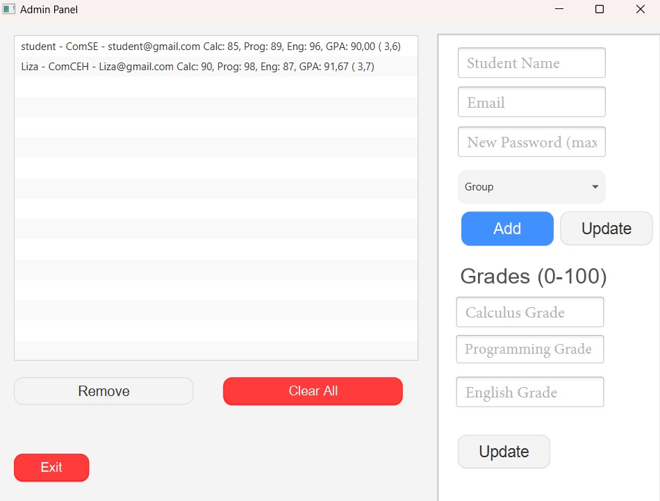
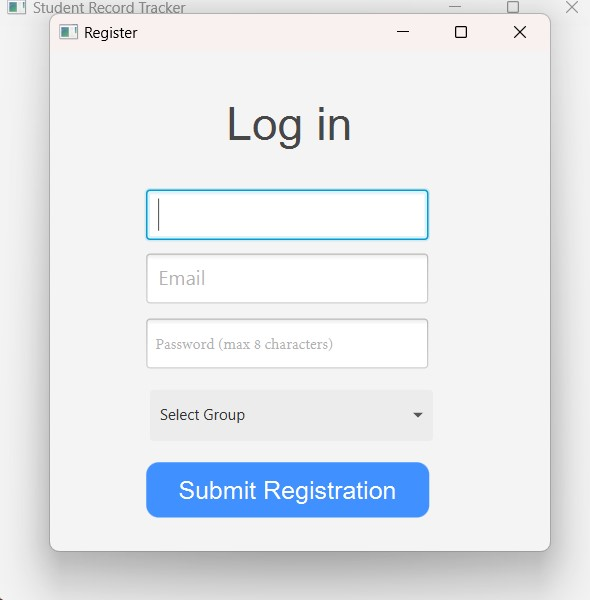
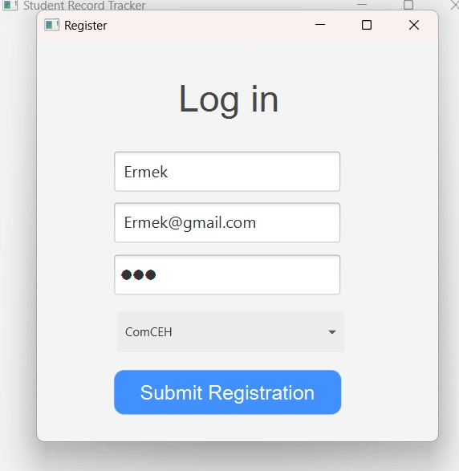

## Run the cod in App.java:

## You can sign in like Admin, Student, Teacher. Firstly we sign in like admin:

##In admin panel you can remove, clear all, add, update students:

## After exit you can click on "log in" and create account like student:

## After you can sign in with new account like student:

